= Beurteilende Statistik (Mathe Mitschrift 01.12.2021)

Keine vollständigen Qualitätskontrollen; Strichprobe entnommen und getestet und somit schließt man auf die Gesamtproduktion.

== Schätzen:

* Fehlerteil p ist nicht bekannt
* Intervall wird angegeben
*  Wahrscheinlichkeit sollte natürlich hoch sein, etwa 95%
** α ... Irrtumswahrscheinlichkeit
** 1 - α ... Vertrauensniveau oder ach konfidenzintervalla

== Testen

* Es gibt eine Vermutung übder den Fehleranteil p
* Stichprobeergebnis dient als Instrument um entscheiden zu können, ob die Vermutung zutrifft oder nicht

== Schätzen von Parametern

Es gibt 2 möglichkeiten:

* Punktschätzung
* Intervallschätzung

=== Punktschätzung

Die Punktschätzung ist eine bestimmung eines einzelnen Wertes zur Schätzung eines unbekannten Parameters.

=== Intervallschätzung

Dabei wird ein Inervall berechnet, in dem der wahre unbekannte Wert (mit einer vorgegebenen Wahrscheinlichkeit) liegt.

== Parameterschätzung bei binomialverteilten Zufallsvariablen

*Buch Seite 249*

x ... fehlerhaften Stücke +
n ... Stichprobe

.Schätzwert p
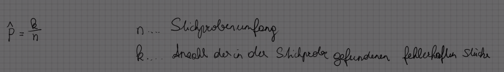

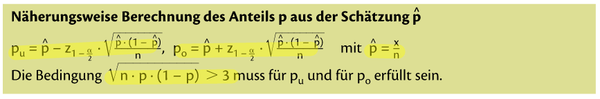

=== Mathcad befehle

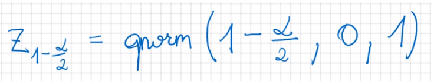

Manchmal möchte man einen bestimmten Bereich nicht unter- brw. überschreiten.

Unter bzw. obere Schranke für den jeweiligen Parameter. Somit kann ich einen Konfidenzintervall hernehmen

.Konfidenzintervall für Unter bzw. obere Schranke
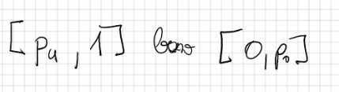

== Parameterschätzung bei normalverteilten Zufallsvariablen

Der Erwartungswert oder mittelwert ist unbekannt.
Glücklicherweise ist die Standardabweichung bekannt.

.Buchs Seite 244
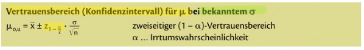

*Gleiche erklärung wie oben:*

.Umgeänderte Version
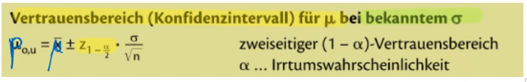

.Zweiseitig Vertrauensbereich
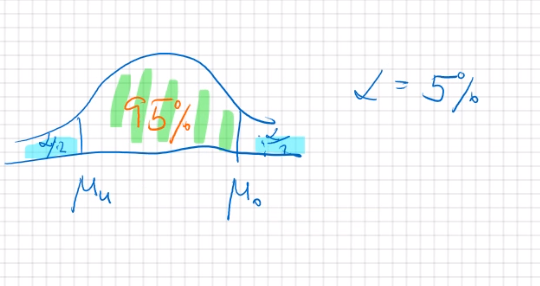

.Einseitiger Vertrauensbereich
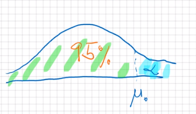

Manchmal möchte man einen bestimmten Bereich nicht unter- brw. überschreiten.

Unter bzw. obere Schranke für den jeweiligen Parameter. Somit kann ich einen Konfidenzintervall hernehmen

_Der einzige Unterschied ist:_

.untere
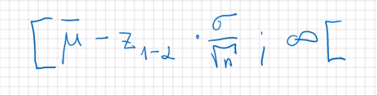

.obere
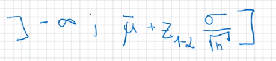

=== Mathcad Formel

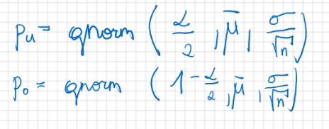
