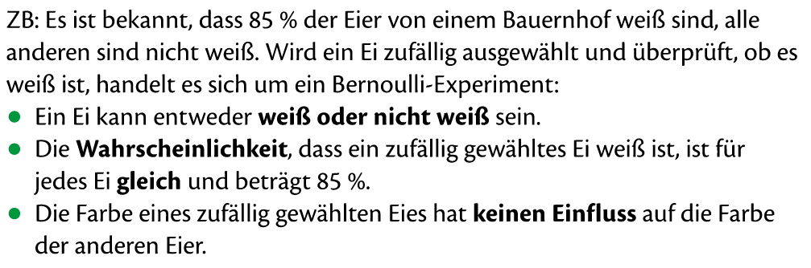
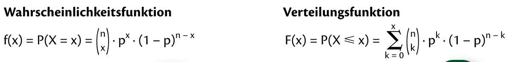
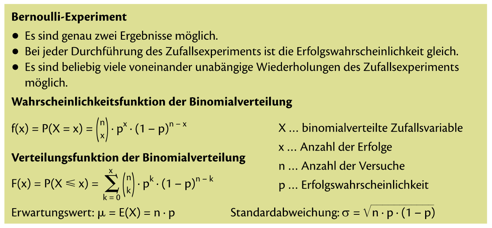

= Binomialverteilung

== Bernoulli-Experiment

Ein Zufallsexperiment wird als Bernoulli-Experiment bezeichnet, wenn es die folgenden Bedingungen erfüllt:

* genau zwei Ergebnisse möglich sind
* nach jeder durchführung, die Wahrscheinlichkeit für _Erfolg_ *gleich* bleibt
* beliebig viele voneinander unabhängige Wiederholungen des Zufallsexperiments möglich sind

*Bernoulli-Experiment* sind eigentlich "*Ziehen mit zurücklegen*" Beispiele.

=== Beispiel Bernoulli-Experimen oder auch "*Ziehen mit zurücklegen*" gennant

Wird ein Bernoulli-Experiment n-mal durchgeführt, so kann die Wahrscheinlichket für die Anzahl der Erfolge mit der sogennten *Binomialverteilung* berrechnet werden.

=== Mini Zusammenfassung

== Mathe SA Index

link:https://davidenkovic.github.io/school-notes/math-sa-15.11.21.html[Mathe SA Index]
