= C |Techno-Notes

== Was ist wichtig in C

=== Strings

Du musst so einiges in C wissen wie zum Beispiel das es keine Strings gibt sondern Char Arrays.

Also wenn du einen String angeben willst, verwende stattdessen ein char[].

``char name[64]`` -> String mit der länge 64.

=== Real Types

Des öfteren kommen Real Types vor. Das sind einfache Variablen wie double, floater oder long double.

link:https://publications.gbdirect.co.uk/c_book/chapter2/real_types.html[Real Types]

=== Input & Output

==== Tabbelle

[cols="1,1"]
|===
|Typ / Zeichensequenz | Buchstaben

|int
|%i oder %d

|long
|%ld

|float/double
|%f

|char
|%c

|char* (string)
|%s
|===

link:https://de.wikipedia.org/wiki/Printf[printf auf wikipedia]

==== Simple string ouput without variable

Um einen einfachen String auszugeben, musst du nur die folgende Zeile verwenden:

`` printf("Hello, world");``

==== String imput in variable

Um einen String einzulesen und diesen dann zu speichern verwendest du *%s*:

``scanf("%s" , name);``

Der Wert den du dann in der Console eingibst wird dann in die Variable *name* gespeichert.

==== String output with variable

Um einen String auszugeben, mit dem Wert einer Variable, verwendest du wie beim einlessen *%s+:

`` printf("Hallo %s!",name)``

==== int input in variable

Um einen int zu Speicher verwendest du *%d*:

``scanf("%d" , &age); ``

==== int output with variable

Um einen int auszugeben, verwendest du *%d*:

`` printf("Sie sind %d Jahre alt! ",age); ``

Wichtig ist das du vor der Variable ein *&* verwendest. (Wegen Pointer und Address)

== Flowgorithm Einführung

=== Hello World

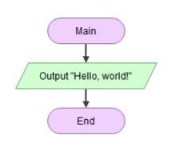

* Main -> Anfang
* Output "Hello, world!" -> Ausgabe von "Hello, world!"
* End - Ende

.Hello World code
[source,c]
----
#include <stdio.h>

int main() // Anfang
{
    printf("Hello, world"); // Ausgabe von "Hello, world!"

    return 0; // Ende
}
----

=== Hello Dave

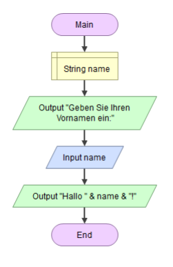

* Main -> Anfang
* string name -> Variable name
* Output -> Fragt nach dem Namen
* Input -> Name eingeben wie z.B. Dave
* Output -> "Hallo Dave!"
* End - Ende

.Hello Dave
[source,c]
----
#include <stdio.h>

int main() // Anfang
{
    char name[32]; // Variable name
    printf("Geben Sie ihren Vornamen ein:"); // Fragt nach dem Namen
    scanf("%s" , name); // Name eingeben wie z.B. Dave
    printf("Hallo %s!",name); // "Hallo Dave!"

    return 0; // Ende
}
----

=== Name und Alter

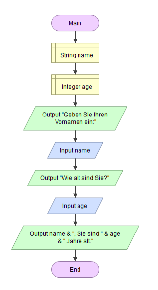

* Main -> Anfang
* string name -> Variable name
* int name -> Variable age
* Output -> Fragt nach dem Namen
* Input -> Name eingeben wie z.B. Dave
* Output -> Fragt nach dem Alter
* Input -> Name eingeben wie z.B. 18
* Output -> "Sie sind Dave und 18 Jahre alt!"
* End - Ende

.Hello Dave and 18
[source,c]
----
#include <stdio.h>

int main() // Anfang
{
    char name[32]; // Variable name
    int age; // Variable age

    printf("Geben Sie ihren Vornamen ein: "); // Fragt nach dem Namen
    scanf("%s" , name); // Name eingeben wie z.B. Dave

    printf("%s, wie alt sind Sie? ",name); // Fragt nach dem Alter
    scanf("%d" , &age); // Name eingeben wie z.B. 18

    printf("%s, Sie sind %d Jahre alt! ",name ,age); // "Sie sind Dave und 18 Jahre alt!"

    return 0; // Ende
}
----

=== Summe

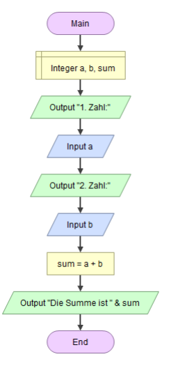

* Main -> Anfang
* Integer a, b, sum -> 3 Variablen a, b und sum (alles int)
* Output -> Fragt nach 1. Zahl
* Input -> Zahl a eingeben wie z.B. 31
* Output -> Fragt nach 2. Zahl
* Input -> Zahl b eingeben wie z.B. 7
* sum = a + b -> Variable b initialisieren mit den werten a + b
* Output -> Die Summe ist sum
* End - Ende

.Summe
[source,c]
----
#include <stdio.h>

int main() // Anfang
{
int a; // Variable a
int b; // Variable b
int sum; // Variable sum

    printf("1. Zahl: "); // Fragt nach 1. Zahl
    scanf("%d" , &a); // Zahl a eingeben wie z.B. 31

    printf("2. Zahl "); // Fragt nach 2. Zahl
    scanf("%d" , &b); // Zahl b eingeben wie z.B. 7

    sum = a + b; // Variable sum initialisieren mit den werten a + b also speichern in sum

    printf("Die Summe ist %d.",sum); // Die Summe ist sum

    return 0; // Ende
}
----

=== Kreis

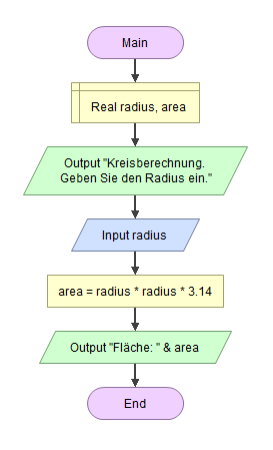

* Main -> Anfang
* Real radius, area -> 2 Variablen radius und area (beide double | link:https://publications.gbdirect.co.uk/c_book/chapter2/real_types.html[Real Types])
* Output -> Fragt Radius
* Input -> Radius eingeben wie z.B. 3
* area = radius * radius * 3.14-> Fläche ausrechnen mit radius * radius * 3.14f und in area speichern (f damit es ein double ist, muss aber nicht sein)
* Output -> Die Fläche ist area
* End - Ende

.Kreis
[source,c]
----
#include <stdio.h>

int main() // Anfang
{
double radius; // Variable Radius
double area; // Variable Fläche

    printf("Kresiberrechnung. Geben Sie den Radius ein: "); // Fragt Radius
    scanf("%lf" , &radius); // Radius eingeben wie z.B. 3

    area = radius * radius * 3.14f; // Fläche ausrechnen mit radius * radius * 3.14f und in area speichern

    printf("Fläche: %lf", area); // Die Fläche ist area

    return 0; // Ende
}
----

== Verzweigung

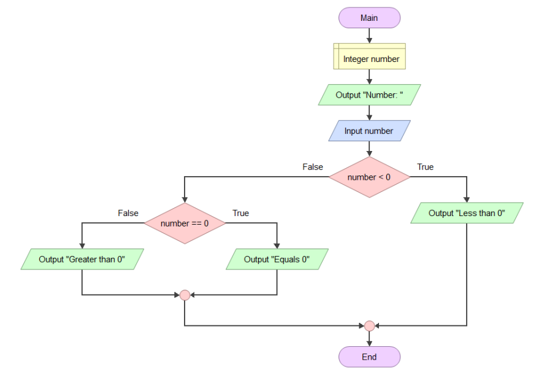

=== Main

Wie bei den oberen Beispielen fangen wir bei dem *Main* Block an und gehen runter bist zu dem *End* Block.

=== Input & Output
Nach dem *Main* Block kommt das Festlegen der Variable _number_.
Das Programm fragt den User nach einer Zahl und diese wird dann auch in der Variable _number_ gespeichert.

=== If

Nach dem ganzen *Output* und *Input* folgt die erste *Verzweigung*.

Die *Verzweigung* prüft ob die oben eingegebene *Zahl größer ist als 0*.

_Folgendes Szenario:_

Der User gibt die Zahl *10* ein. Heißt automatisch das die Bedingung, also *Zahl größer als 0*, _richig_ ist.

``10 > 0 -> true``

Wenn der User aber *0* eingibt, ist die Bedigung falsch.

``10 > 0 -> false``

Würde der User eine negative Zahl eingeben dann wäre die Bedingung ebenso Falsch.

``-10 > 0 -> false``

==== if true

Wenn also die Bedingung True ist, hüpft unser Programm in die Anweisung ein.

In anderen Worten in den Körper der *iF-Verzweigung*.

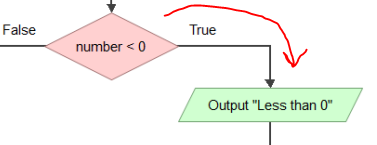

Das Programm gibt aus: _"Less than 0"_

==== if false

Wenn die bedingung falsch ist, geht unser Programm weiter und ignoriert sommit, was in dem Körper der if-Verzweigung steht.

Da es bei diesem Beispiel keinne *else* gibt kommt gleich nach den wider eine *if*.

Diese Wird aber *elseif* genannt.

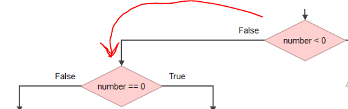

=== else if

Eine *Elseif* ist das gleiche wie eine normale if nur das sie erst dann verwendet wird, wenn nach einer if-Verzweigung eine weitere Überprüfung stattfinden soll.

In unserem Beispiel soll unser Programm bei der ersten *if-VErzweigung* überprüfen ob die Zahl größer als null ist.
Wenn das nicht der Fall ist, sollte unser Programm gleich wieder Überprüfen ob es sich um die Zahl *0* handelt oder um eine *negative Zahl*.

==== else if false

Wenn der User oben *100* eingegeben hat, trifft folgendes Szenario auf.

``100 == 0 -> false``

somit hüpft unser Programm aus der Verzweigung raus.

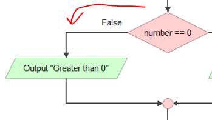

===== else if true

Wenn der User aber *0* eingegeben hat dann ist die Bedingung *true*.

``0 == 0 -> true``

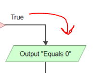

=== End

Egal welchen weg unser Programm gewählt hat wir kommen immer zum Ende.
Was aber währen dem Weg ausgegeben wurde hängt von der *user eingabe* ab da in den beiden verzweigungen unterschiedlichen Ausgaben passiert sind.

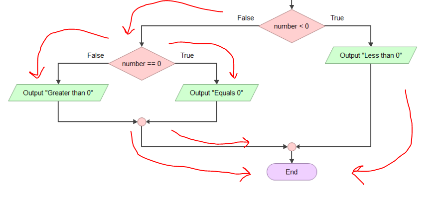

== Verzweigung Code

So würde unser Beispiel als Code aussehen:

[source, c]
----
#include <stdio.h>

int main() //anfang
{
    int number;

    printf("Geben Sie eine Zahl ein: ");
    scanf("%d" , &number); // Zahl einlessen

    if(number < 0){ // Ist die Zahl Kleiner als 0?
        printf("Less than 0"); // Ja! Die Zahl is Kleiner als 0.
    }
    else if(number == 0){ // Die Zahl war kleiner als null doch ist sie jetzt gleich 0?
        printf("Equals 0"); // Ja! Die Zahl ist gleich 0.

    }
    else{ // Die Zahl war nicht kleiner als 0 und auch nicht gleich 0.
        printf("Greater than 0"); // Die Zahl kann jz nur größer als 10 sein
    }

    return 0;
}
----

== Wichtiges über die Verzweigung

=== Vergleichsoperatoren

[cols="1,1,1"]
|===
| Operator | Operator | Beispiel

| *==*
| gleich
| a == b

| !=
| ungleich
| a != b

| <
| kleiner
| a < b

| >
| größer
| a > b

| <=
| kleiner geich
| a <= b

| >=
| größer gleich
| a >= b

|===

=== Der Modulo-Operator

Wir haben bis jetzt die Operatoren +, -, * und / kennengelernt. Jetzt kommt noch einer dazu:

*Der Modulo-Operator %.*

Der Modulo-Operator berechnet den Rest einer ganzzahligen Division.

* 5 % 2 = 1 -> 5 dividiert durch 2 ist 2, Rest 1.
* 20 % 3 = 2 -> 20 dividiert durch 3 ist 18, Rest 2
* 37 % 10 = 7 -> 37 dividiert durch 10 ist 3, Rest 7

Wenn ich den Modulo-Operator in einer Bedingung verwende, wird das häufig gemacht, ob der Rest
einer Division gleich einem bestimmten Wert ist. Für die Gleichheit verwenden wir das doppelte Gleichheitszeichen ==.

Um zu prüfen, ob der Rest der Division durch 2 gleich 0 ist, schreibt man also:

``a % 2 == 0``

*Diese Bedingung ist wahr, wenn a eine gerade Zahl ist!*

== Bedingungen verknüpfen

Wenn du bei einer Bedingung 2 Abfragen haben willst, läuft das so ab:

Es gibt zwei arten von Verknüpfungen.

=== Und-Verknüpfung &&

Bei der *Und-Verknüpfung* werden 2 (oder mehr) Bedingungen zusammen gesetzt und *beide müssen true sein*.

Z.B.:

[source,c]
----
if(number > 0 && number < 10){
    printf("Die Zahl ist zwischen 0 und 10");
}
----

Mann kann auch mehrere Bedingungen anhängen. Wichtig ist das alles True sein muss um in den Body zu kommen.

Z.B.:

[source,c]
----
if(number > 0 && number < 10 && number != 5){
    printf("Die Zahl ist zwischen 0 und 10 darf aber nicht 5 sein");
}
----

=== Oder-Verknüpfung ||

Anders bei der Und-Verknüpfung müssen hier nicht alle Bedingungen *True* sein.

Z.B.:

[source,c]
----
if(number == 0 || number == 10 || number == 5){
    printf("Die Zahl ist entweder 0, 5 oder 10");
}
----
