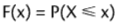
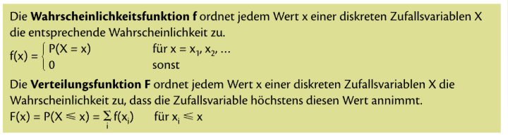

= Mathe SA am 15.11.2021

* Binomialverteilung (ab BS 204)
* Hypergeometrische Verteilung (ab BS 213)
* Poissonverteilung (BS 216)
* Normalverteilung (ab BS 218)
* Standardnormalverteilung (ab BS 222)
* Statistik

== Binomialverteilung

=== Wahrscheinlichkeitsfunktion f

Die Wahrscheinlichkeitsfunktion f ordnet jedem Wert einer diskreten Zufallsvariablen X die Wahrscheinlichkeit zu, dass X *genau* diesen Wert annimmt:

image::../images/image-2021-11-12-19-32-07-546.png[]

Die Summe aller Funktionswerte von f ist 1.

=== Verteilungsfunktion F

Die Verteilungsfunktion F ordnet jedem Wert einer Diskreten Zufallsvariablen X die Wahrscheinlichkeit zu, dass X *höchstens* diesen Wert annimmt:

Sie ist also die Summe der Einzelwahrscheinlichkeit bis zu diesem Wert.

==== Mini Zusammenfassung
