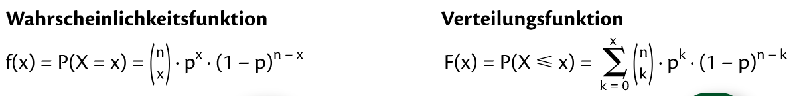
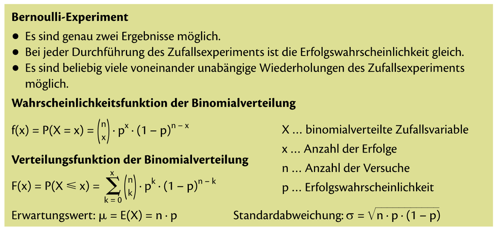

= Mathe SA am 15.11.2021

== Stoff

* Binomialverteilung (ab BS 204)
* Hypergeometrische Verteilung (ab BS 213)
* Poissonverteilung (BS 216)
* Normalverteilung (ab BS 218)
* Standardnormalverteilung (ab BS 222)
* Statistik

== Grundbegriffe

=== Wahrscheinlichkeitsfunktion f

Die Wahrscheinlichkeitsfunktion f ordnet jedem Wert einer diskreten Zufallsvariablen X die Wahrscheinlichkeit zu, dass X *genau* diesen Wert annimmt:

image::images/image-2021-11-12-19-32-07-546.png[]

Die Summe aller Funktionswerte von f ist 1.

=== Verteilungsfunktion F

Die Verteilungsfunktion F ordnet jedem Wert einer Diskreten Zufallsvariablen X die Wahrscheinlichkeit zu, dass X *höchstens* diesen Wert annimmt:

image::images/image-2021-11-12-19-37-29-227.png[]

Sie ist also die Summe der Einzelwahrscheinlichkeit bis zu diesem Wert.

==== Mini Zusammenfassung
image::images/image-2021-11-12-19-41-25-155.png[]

==== Beispiel Wahrscheinlichkeitsfunktion & Verteilungsfunktion

image::images/image-2021-11-12-21-28-10-156.png[]

=== Erwartungswert, Varianz und Standardabweichung bei diskreten Verteilungen

Der Erwartungswert E(X) einer Zufallsvariablen X ist jener Wert, den die Variable im Mittel annimmt.

Um zu berechnen, wie stark die Werte um diesen Mittelwert streue, brechnet man die Varianz V(X).

==== Mini Zusammenfassung Erwartungswert & Varianz
image::images/image-2021-11-12-21-30-48-087.png[]

==== Beispiel Erwartungswert & Varianz
image::images/image-2021-11-12-21-34-34-798.png[]

== Binomialverteilung

=== Bernoulli-Experiment

Ein Zufallsexperiment wird als Bernoulli-Experiment bezeichnet, wenn es die folgenden Bedingungen erfüllt:

* genau zwei Ergebnisse möglich sind
* nach jeder durchführung, die Wahrscheinlichkeit für _Erfolg_ *gleich* bleibt
* beliebig viele voneinander unabhängige Wiederholungen des Zufallsexperiments möglich sind

*Bernoulli-Experiment* sind eigentlich "*Ziehen mit zurücklegen*" Beispiele.

==== Beispiel Bernoulli-Experimen oder auch "*Ziehen mit zurücklegen*" gennant

image::images/image-2021-11-12-21-46-29-710.png[]

Wird ein Bernoulli-Experiment n-mal durchgeführt, so kann die Wahrscheinlichket für die Anzahl der Erfolge mit der sogennten *Binomialverteilung* berrechnet werden.

==== Mini Zusammenfassung

== Hypergeometrische Verteilung
