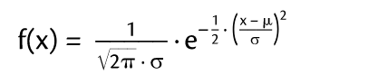
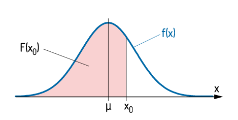
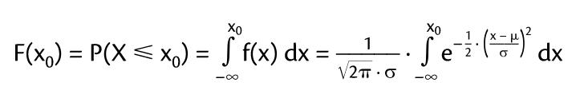
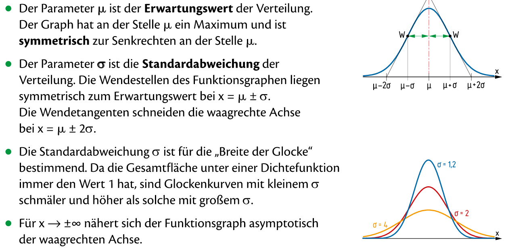
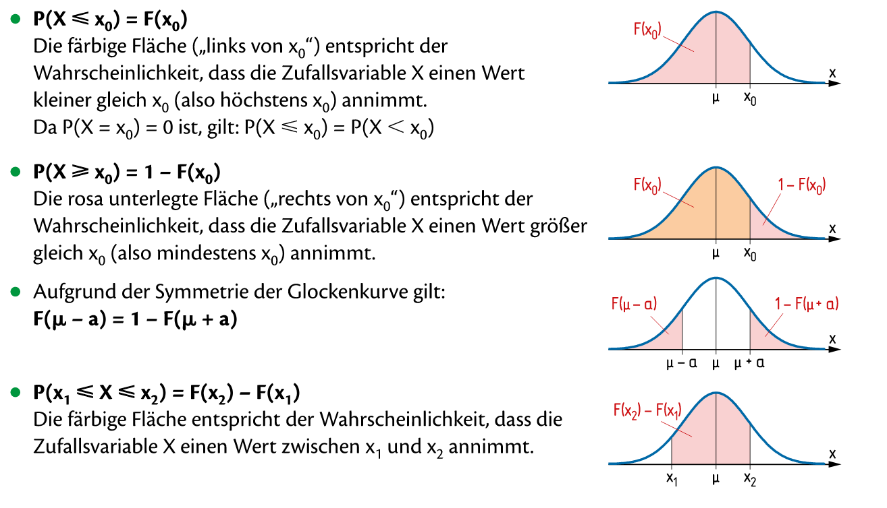
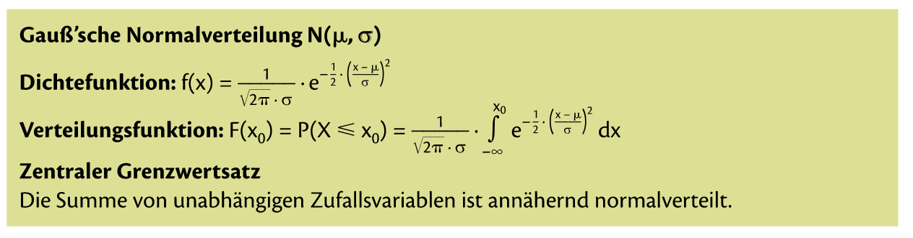

= Normalverteilung

== Was ist die Normalverteilung

_"Dazu gibts keine praktischen Beispiele glaub ich. Also zum Rechnen.
Normalverteilung is einfach die glockenfubktion.
Bei Normalverteilung rechnet man eig immer mit Tabelle"_ *~ Benjo*

Was meint Benjo damit? - _Normalverteilung und Standardnormalverteilung ist dasselbe_.

Bisher haben wir immer mit *diskreten Zufallsvariablen* gearbeitet, die nur *bestimmte* Werte annehmen.

Bei der Normalverteilung werden *stetige Zufallsvariablen* behandelt, die in einem gewissen *Berreich* jeden beliebigen Wert annehmen können.

Weil eine *stetige Zufallsvariable* unendlich viele Werte annehmen kann, ist es unmöglich, für jeden einzelnen Wert die Wahrscheinlichkeit zu berrechnen.
Deswegen gibt es keine Wahrscheinlichkeitsfunktion wie bei *diskreten Zufallsvariablen*

== Daniel Jung Abi (gutes Beispiel)

link:https://www.youtube.com/watch?v=_f1vgWUiavY&list=PLLTAHuUj-zHj7qBEx4VYSTjzTEtntuycU&index=1[Video by Daniel Jung]

== Simple Math - Zusammenhang Binomialverteilung und Normalverteilung

link:https://www.youtube.com/watch?v=gP-Xx26p_kc[Zusammenhang Binomialverteilung und Normalverteilung]

== Simple Math - Normalverteilung

link:https://www.youtube.com/watch?v=_rVt6qTkea8[Normalverteilung / Gaußverteilung]

=== Zusammengefasst by Dave

==== Dichtefunktion der Normalverteilung

In dem Diagramm unten sehen wir das f(x) die Dichtefunktion ist. F(x0) ist die Verteilungsfunktion.

Wie schon bei der Binomialverteilung gesagt, is F(x0) die Summe der Einzelwahrscheinlichkeit bis zu diesem Wert.

Die Formel fur F(x) lautet:

Um diese Formel aber zu vermeiden, verwenden wir die
link:https://davidenkovic.github.io/school-notes/standardnormalv.html[Standardnormalverteilung]

== Merkmale und Eigenschaften der Glockenkurve

=== Funktion

=== Fläche

== Mini Zusammenfassung

== Mathe SA Index

link:https://davidenkovic.github.io/school-notes/math-sa-15.11.21.html[Mathe SA Index]
