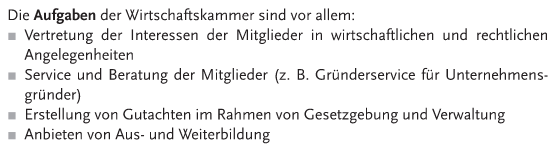
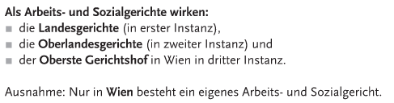
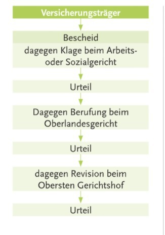
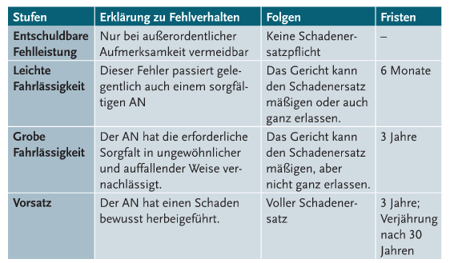

= Recht Road2Goat

*Danke an Nathalie Herzog aka Natsu*

A) +

Womit konkret befassen sich die Sozialpartner in diesen Zeiten? Nennen Sie ein Beispiel (außerhalb von Kollektivvertragsverhandlungen)! Wie verhandeln sie Ihre Angelegenheiten?

*Antwort*:

* Sie befassen sich mit Corona Maßnahmen am Arbeitsplatz.

* Sie verhandeln mit Streiks und Aussperren.

---

B) +

Wie entscheiden Sozialpartner und welche Themen sind den Sozialpartner derzeit besonders wichtig? Nennen Sie ein Beispiel (außerhalb von Kollektivvertragsverhandlungen)!

*Antwort*:

* sozialpartner entscheiden so, dass streiks vermieden werden und dass sozial- und wirtschaftspolitische probleme ohne konflikte gelöst werden

* Wichtig ist Corona Maßnahmen am Arbeitsplatz.

---

A) +

Für welche Personen ist der österreichische Gewerkschaftsbund die Vertretung?

*Antwort*:

Für die Arbeitnehmer (AN)

.Antwort Details
[%collapsible]
====
[source,text]
----
Interessensverbände:

- Arbeitnehmerseite
-- Arbeiterkammer
-- Österreichischer Gewerkschaftsbund

- Arbeitgeberseite
-- Wirtschaftskammer
-- Landwirtschaftskammer
----
====
---

B) +

Für welche Personen ist die Landwirtschaftskammer die Vertretung?

*Antwort*:

Für die Arbeitgeber. (AG)

.Antwort Details
[%collapsible]
====
[source,text]
----
Interessensverbände:

- Arbeitnehmerseite
-- Arbeiterkammer
-- Österreichischer Gewerkschaftsbund

- Arbeitgeberseite
-- Wirtschaftskammer
-- Landwirtschaftskammer
----
====
---

A) +

Welche Aufgaben hat die Wirtschaftskammer? Nennen Sie drei unterschiedliche Beispiele!

*Antwort*:

_Aufgaben:_

* Informieren
* Beraten
* Rechtlich vertreten
* Interesse vertreten

.Antwort Detail
[%collapsible]
====

====

_Beispiele:_

* Arbeitsschutz
* Finanzberatung
* Information Corona

---

B) +

Welche Aufgaben hat die Arbeiterkammer? Nennen Sie drei unterschiedliche Beispiele!

*Antwort*:

_Aufgaben:_

* Arbeit und Recht
* Steuer und Geld
* Bildung
* Beruf Familie
* Arbeit und Gesundheit
* Konsumentenschutz

_Beispiele:_

* Was kann ich tun, wenn ich gekündigt werde?
* Wie viel Lohn steht mir zu?
* Bildungsförderung.

.Antwort Detail
[%collapsible]
====

====

---

A) +

Wie endet ein Praktikum üblicherweise? Begründen Sie ihre Antwort!

*Antwort*:

Ein Praktikum ist befristet, daher endet es am vereinbarten Tag. (ende Arbeitsverhältnis)

---

B) +

Wie endet ein Ferialjob üblicherweise? Begründen Sie ihre Antwort!

*Antwort*:

Ein Ferialjob geht üblich 1 Monat lang. Es endet am vereinbarten Tag. (ende Arbeitsverhältnis)

---

A) +

Zu welchen Pflichten gehört die Entgeltleistung? Wie sieht diese aus? Welche Konsequent hätte ein Verstoß dagegen?

*Antwort*:

Entgeltleistung ist die Pflicht vom Arbeitgeber den Lohn auszuzahlen. (Entgeltpflicht)

Grundlohn + Premien und Sonderzahlungen (Weihnachtsgeld,...)

Wenn nicht gezahlt wird, kann man austretten.

---

B) +

Zu welchen Pflichten gehört die Verschwiegenheitspflicht? Wie sieht diese aus? Welche Konsequent hätte ein Verstoß dagegen?

*Antwort*:

Es gehört zur Treuepflicht.

Es dürfen keine Betriebsgeheimnisse verbreitet werden oder lügen.

Konsequenz wäre Kündigung.

---

A) +

Was zeichnet einen Freien Dienstvertrag aus?

*Antwort*:

Es bedeutet das man nicht eng mit dem Arbeitgeber gebunden ist. Man ist vertretbar, arbeitet meist von zu Hause und es gibt keine Erfolgsgarantie.

---

B) +

Was unterscheidet einen Werkvertrag von einem Dienstvertrag?

*Antwort*:

Bei einem Werkvertrag ist man selbst verantwortlich wie oft man arbeitet, hauptsache das Werk ist zum Schluss fertig.

---

A) +

Wann ist eine Entlassung gerechtfertigt? Beschreiben Sie 2 Beispiele.

*Antwort*:

* Sexuelle belestigung
* betrunken am Arbeitsplatz
* verweigerung des Arbeiten

---

B) +

Wann ist ein vorzeitiger Austritt berechtigt? Beschreiben Sie 2 Beispiele.

*Antwort*:

Wenn man gemobbt wird, sexuell belästigt wird oder kein geld bekommt, kann man austreten.

_Beispiel:_

* Kein Lohn bekommen
* Auf dem arbeitsplatz gemobbt werden

---

A)B) +

Welches Gericht ist für die Arbeitsrechtsachen in zweiter Instanz zuständig? Beschreiben Sie ein Beispiel aus der Praxis für eine Arbeitsrechtssache, die dort verhandelt wird!

*Antwort*:

Oberlandes Gericht

_Beispiel:_

Arbeitnehmer fordern besser bezahlte überstunden.

.Antwort Detail
[%collapsible]
====

====

---

A) +

Ein Angestellter ist mit einem Dienstfahrzeug unterwegs. Plötzlich springt ein Reh über die Fahrbahn. Ein Unfall ist nicht mehr vermeidbar. Wie sieht die Haftung des Angestellten für den Sachschaden am Fahrzeug aus? Begründen Sie ihre Entscheidung und die Rechtsfolgen für diesen konkreten Fall!

*Antwort*:

Entschuldbare fehlleistung.

Es wäre nur bei außerordentlicher aufmerksamkeit verhinderbar gewesen.

Somit keine schadenersatzpflicht.

.Antwort Detail
[%collapsible]
====

====

---

B) +

Ein Arbeiter ist mit einem Dienstfahrzeug unterwegs. Nach seinem letzten Außendiensteinsatz, bei dem ein Glas Wein den Vertragsabschluss besiegelt hat, fährt er nach Hause. Beim Einparken kommt er zu nah and die Gartenmauer. Das Fahrzeug ist leicht beschädigt. Wie sieht die Haftung des Angestellten für den Sachschaden am Fahrzeug aus? Begründen Sie ihre Entscheidung und die Rechtsfolgen!

Grobe fahrlässigkeit

Der Fahrer war leicht alkoholisiert und somit nicht aufmerksam genug.

Gericht kann den Schadenersatz mäßigen, aber nicht ganz erlassen. Frist 3 Jahre

.Antwort Detail
[%collapsible]
====

====

*Antwort*:

---

A) +

Wer schließt worüber eine Betriebsvereinbarung ab? Nennen Sie ein Beispiel.

*Antwort*:

Vereinbarung zwischen Arbeitgeber und Betriebsrat.

_Beispiel:_

Details zum Urlaub, Arbeitsschutz, etc

---

B) +

Was ist in einem Kollektivvertrag geregelt? Nennen Sie drei Beispiele.

*Antwort*:

* Arbeitszeit
* Lohn
* Urlaub

---

A) +

Was bedeuten Codes im Dienstzeugnis? Erklären Sie dies anhand zweier Beispiele.

*Antwort*:

Es zeigt an wie gut man gearbeitet hat.

* Arbeit motiviert gemacht
* unangenehmer Arbeiter

---

B) +

Was muss in einem Dienstzeugnis vermerkt sein?

*Antwort*:

* Anschrift
* geleistete Arbeit
* Arbeitsstunden

---

A)In einer IT-Firma sind Sie vollzeitbeschäftigt und reif für den zweiwöchigen Urlaub. Kaum lässt der Stress nach, erkranken Sie. Am dritten Tag sind Sie sich wieder fit. Was bedeutet das?

*Antwort*:

Ich führe den Urlaub weiter.

---

B)Sie arbeiten in einer IT-Firma und treten Ihren Urlaub an. Leider infizieren Sie sich mit dem Corona-Virus. Sie müssen für zwei Wochen in Quarantäne. Was bedeutet das?

*Antwort*:

Ich teile es meinem Arbeitgeber mit und der Urlaub wird nicht weiter geführt sondern man ist im Krankenstand.
