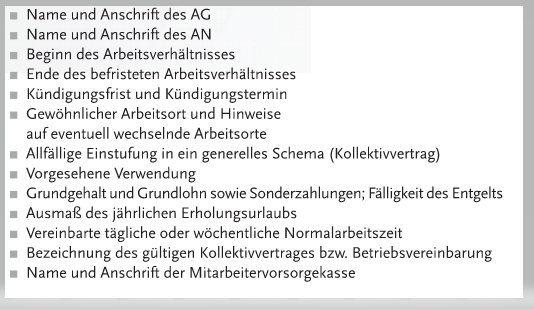

= Recht-Test

== Links

link:../files/Recht-Zusammenfassung.pdf[Meris Zusammenfassung 5AHITM]

== Stoff

* Arbeitsrecht Seite 146 bis 174
** 1. Gliederung des Arbeitsrechts (alles)
** 2. Arbeitsvertragsrecht (alles)
** 3. Arbeitnehmerschutz (grob)
*** Arbeitszeit und Arbeitsruhegesetz
** 4. Kollektives Arbeitsrecht
*** Kollektivverträge
*** Betriebsvereinbarung
*** Streikrecht
* Sozialpartnerschaft Seite 66 bis 73
** 1. Was ist die Sozialpartnerschaft (alles)
** 2. Interessenverbände der Sozialpartnerschaft (grob)
* Arbeits- und sozialgerichtliches Verfahren (nur die Seite)

== Arbeitsrecht

=== Gliederung des Arbeitsrechts

Unter Arbeitsrecht versteht man die Gesamtheit der Bestimmungen, die die Beziehung der an einem abhängigen Dienstverhältnis beteiligten Personen regeln.

Die Aufgabe des Arbeitsrechts ist es, das ökonomische und soziale Ungleichgewicht zwischen der Arbeitnehmer und Arbeitgeber auszugleichen.

Das Arbeitsrecht wird unterteilt in *Individualarbeitsrecht* und *Kollektives Arbeitsrecht*.

==== Stufenbau der Rechtsvorschriften

=== Arbeitsvertragsrecht

Wofür dient der Arbeitsvertrag?

Klare Vereinbarungen verhindern Konflikte. Also Im Arbeitsvertrag steht genau, was der Arbeitnehmer zu tun hat.

.Festgelegte Punkte des Arbeitsvertrags

==== Arbeitsverhältnis

Die Merkmale davon sind:

* Der Arbeitnehmer stellt seine Arbeitskraft gegen Bezahlung eines *Entgelts* dem Arbeitgeber zu Verfügung.
* Der Arbeitnehmer ist *wirtschaftlich* und *persönlich* (Weisungsgebundenheit) vom Arbeitgeber *abhängig*.
* Es besteht *persönliche Arbeitspflicht*, d.h. der Arbeitnehmer kann sich nicht vertreten lassen.
* Der Arbeitgeber stellt dem arbeitnehmer *Arbeitsmittel+ zur verfügung. (PC, Telefon, ...).
* Es besteht persönliche *Treue- und Fürsorgepflicht*.
* Der Arbeitnehmer hat sich in die betriebliche Organisation einzuordnen.

==== Arbeitsvertrag

* *Form*
** grundsätzlich formfrei
** kann schriftlich, mündlich oder durch schlüssige Handlung abgeschlossen werden
** Lehrverträge müssen* schriftlich sein

* *Übereinstimmung*
** AG und AN müssen sich über alle wesentliche Punkte der Arbeitsverhältnis einig sein

* *Geschäftfähigkeit*
** der Abschluss eines Arbeitsvertrages is erst mit der Geschäftsfähigkeit, die im Allgemeinen mir der Volljährigkeit eintritt. (Also erst 18 dann Abschluss)
** *Ausnahme*: außer 14-Jährige, welche die Schule abgeschlossen haben.

* *Möglichkeit und Erlaubtheit der Vertragsinhaltes*
** Die Rechtsfolgen bei *Unmöglichkeit und Unerlaubtheit* richten sich nach allgemeinen schuldrechtlichen Grundsätzen.
*** _Bsp: Bezahlung eines LKW-Fahrers nach Km und nicht nach geleisteter Arbeit._

*Wichtig*: +
Wenn kein schriftlicher Arbeitsvertrag ausgestellt wird, muss der AG dem AN einen *Dienstzettel* ausstellen.

Wenn die arbeit aber höchstens einen Monat dauert, wird kein *Dienstzettel* benötigt. (Praktikum)

===== Was muss im Dienstvertrag drin stehen?

===== Probearbeitsverhältnis

Das Arbeitsverhältnis wird nur *vorläufig* eingegangen und kann jederzeit ohne Angabe von Gründen gelöst werden.

In der Regel besteht diese *Lösungsmöglichkeit einen Monat* lang.

===== Sonderformen von Arbeitsvertägen

*Freier Dienstvertrag*

image::images/image-2021-12-08-17-58-22-209.png[]

*Werkvertrag*

Beim Werkvertrag verpflichtet sich der Auftragnehmer zur Erbringung eines Erfolges oder zur Herstellung eines Werkes.

Das Entgelt wird nur dann bezahlt, wenn die *Leistung laut Vertrag* erbracht wird.

Arbeitsort und Arbeitszeiten werden nicht angegeben, der AN arbeitet selbständig.

==== Pflichten des Arbeitgebers

===== Entgeltleistung

Der AG muss dem AN ein *Entgelt* zahlen. Die höhe des *Entgelts* richtet sich in erster Linie nach den Vereinbarungen im *Arbeitsvertrag*.

===== Entgeltfortzahlung im Krankheitsfall

Der AN hat eine Mitteilungspflicht und Nachweispflicht gegenüber dem AG.

===== Entgeltfortzahlung im Urlaub

Der AN hat Anspruch auf den gesetzlich vorgeschriebenen Mindesturlaub. In dem Zeitraum muss der AG dem AN das Entgelt weiterbezahlen.

Der AN muss sich mit dem AG den Urlaubsantritt ausmachen und kann es nicht selbständig machen.

*Wichtig*: eine Erkrankung unterbricht den Urlaub.

===== Fürsorgepflicht

Der AG hat zu sorgen:

* das Leben und die Gesundheit seiner Mitarbeiter möglichst zu schützen (Schutzkleidung,...)
* Schutz der Persönlichkeit (Mobbing, Belästigung)

==== Pflichten des Arbeitnehmer und der Arbeitnehmerin

===== Arbeitspflicht

===== Treuepflicht

Der AN hat die betrieblichen und unternehmerischen Interessen der AG zu beachten.

====== Sorgfalts- und Haftpflicht

==== Beendigung des Arbeitsverhältnisses

===== Zeitablauf

===== Auflösung während der Probezeit

===== Einvernehmliche Lösung

===== Kündigung

===== Entlassung und Austritt

==== Ansprüche währen und nach Beendigung eines Arbeitsverhältnisses

