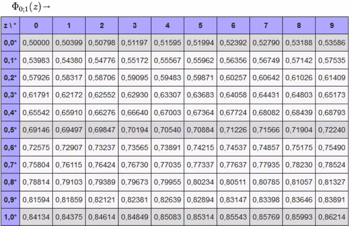

= Standardnormalverteilung

== Simple Math Normalverteilung - Gaußverteilung

link:https://www.youtube.com/watch?v=_rVt6qTkea8[Verteilungsfunktion Φ minute 3:33]

=== Zusammengefasst by Dave

Mit der Verteilungsfunktion Φ rechnet man sich die Fläche unter einer bestimmten Funktion ohne integrieren zu müssen.

Wenn dann zum Beispiel Φ(0.88) rauskommt muss dieser Wert in einer Tabelle gesucht werden.

Wenn in dem Φ was Negatives steht, wie zum Beispiel Φ(-0.43), dann rechnet man einfach:

*1- Φ(0.43)*

== Mathe SA Index

link:https://davidenkovic.github.io/school-notes/math-sa-15.11.21.html[Mathe SA Index]
