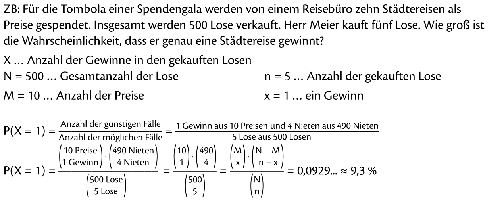
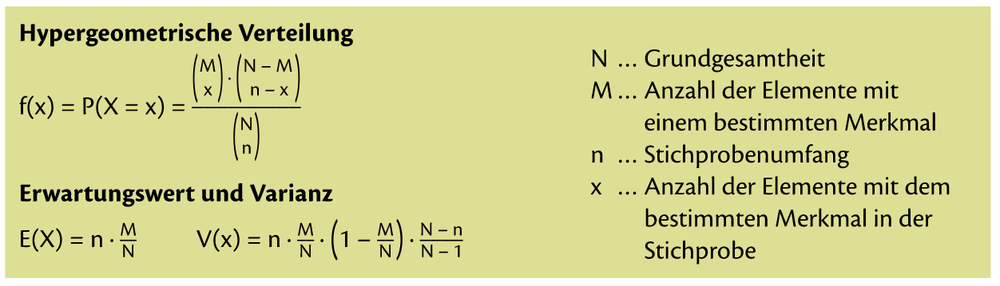

= Hypergeometrische Verteilung

== Was ist die Hypergeometrische Verteilung

Kurzgefasst verwendet man die Hypergeometrische Verteilung bei Experimenten wie "Ziehen ohne Zurücklegen". Also quasi gegenteil von Binomialverteilung.

Man geht davon aus, dass in einer Menge von N Elementen, M Elemente ein bestimmtes Merkmal aufweisen. Aus dieser Menge wird eine Stichprobe vom Umfang n gezogen.

Die Wahrscheinlichkeit, dass genau x Elemente in dieser Stichprobe des Merkmal aufweisen, wird mit der hypergeometrischen Verteilung ermittelt.

== Beispiel Hypergeometrische Verteilung

== Mini Zusammenfassung

== Mathe SA Index

link:https://davidenkovic.github.io/school-notes/math-sa-15.11.21.html[Mathe SA Index]
