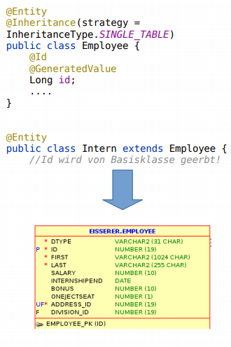
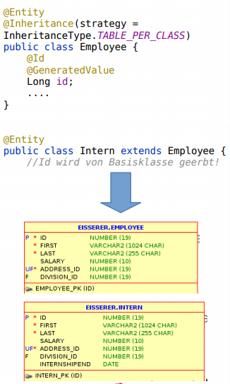
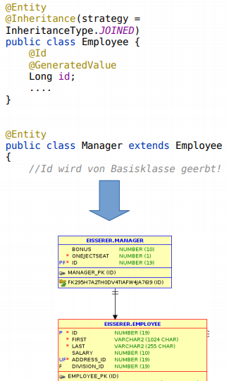
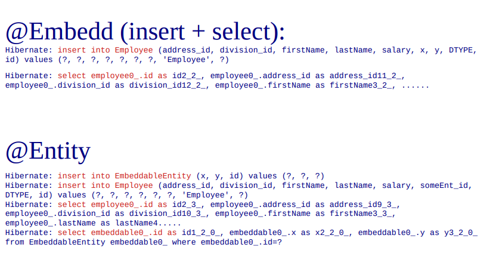

= JPA Zusammenfassung
:icons: font
:sectnums:
:toc: left
:iconfont-cdn: path/to/fontawesome.css

== Entity

=== Begriffe

Primärschlüssel (@Id) können durch die Datenbank generiert werden
(@GeneratedValue).

Strategien sind: Identity, Table, Sequence und Auto.

*Auto*: Default, wenn nichts angegeben wird. Bei Hibernate Auto = Sequence.

*Sequence*: Neue Ids werden über eine Sequence generiert, vielfältige.
Konfigurationsmöglichkeiten:

*Identity*: Auto-Increment Spalte.

*Table*: Tabelle "emuliert" Sequence.

=== Code Bsp

.Entity Code
[source,java]
----
@Entity
public class Employee {
     @Id
     @GeneratedValue(strategy = GenerationType.AUTO)
     Long id;
     String name;
     long salary;
     public Employee() {}
}
----

== Entity Manager

=== Begriffe

Der EntityManager verwaltet die Entitäten.

Er synchronisiert die Objekt- und Datenbankidentität von verwalteten
Entitäten automatisch.

Erst zum Commit-Zeitpunkt werden Änderungen an verwalteten Objekten
(Entities) in die relationale Datenbank übertragen.

==== Wichtige Methoden:

* persist
* merge
* refresh
* remove

=== Persistierbare Datentypen

Was kann man Persistieren?

* Primitive Datentypen (int, char, ...) und Wrapper-Objekte (Integer, ..)
* Strings
* BigInteger und BigDecimal
* Date und Calendar
* Collections und Arrays von persistierbaren Typen
* Enumerations
* Entity-Typen und Collections von Entitytypen
* Eingebettete Klassen
* Serialisierbare Datentypen (-> Blob)

== Mapping

Es wird immer vom Default-Verhalten ausgegangen (Convention over
Configuration).

Das Default-Verhalten kann aber angepasst werden:

[source, java]
----
@Entity
@Table(name = "EMP")
public class Employee {
    @Id
    @Column(name = "EMP_ID")
    private String name;
}
----

=== Arten von Mapping

* Klassename = Tabellenname - @Table
* Property-Name = Spaltenname - @Column
* String auf VARCHAR - @Column(length=20)
* Ausnahmen sind anzugeben (nicht die Regel)
* @Column(columnDefinition="varchar2(20)")
* Andere Namen @Column(name = "myName")
* Nicht persistente Properties - @Transient
* NOT NULL - @Column(nullable = false)

== Beziehungen

=== Beziehungen zwischen Tabellen

3 Arten:

* 1:1
* 1:n
* n:m

=== Möglichkeiten zur Navigation im Klassenmodel

.Bidirektional
[plantuml,diagram-classes-1, png]
....
left to right direction
class1 <--> class2
....


[plantuml,diagram-classes-2, png]
....
left to right direction
class1 --> class2
....
.Unidirektional
[plantuml,diagram-classes-3, png]
....
left to right direction
class1 <-- class2
....

=== 1:1 Beziehung unidirektional

[source, java]
.Code
----
@Entity
public class Employee {
    @Id
    @GeneratedValue
    Integer id;

    int salary;
    String firstName;
    String lastName;

    @OneToOne
    Address address;
}

@Entity
public class Address {
    @Id
    @GeneratedValue
    Integer id;
    String street;
    @Column(name = "addrNum")
    String number;
    String zipCode;
    String city;
}
----

.cld
[plantuml,diagram-classes-4, png]
....
left to right direction

class Employee{
    String firstName
    String lastName
    int salary
}
class Address{
    String street
    String number
    String zipCode
    String city
}

Employee "0..1"-->"0..1" Address : address
....

Es müssen alle miteinander in Beziehung stehenden Entitäten im Zustand "managed" sein:

[source, java]
.Managed
----
Employee emp = new Employee(800, "Hermann", "Mayr");
Address a1 = new Address("Himbeerstrasse", "22a", "4440", "Steyr");
emp.setAddress(a1);
em.persist(a1);
em.persist(emp);

----

Standardmäßig wird bei unidirektionalen Beziehungen eine Assoziativtabelle angelegt / verwendet (da Address keine Foreign-KeySpalte besitzt).

Ist dies nicht erwünscht (meistens), kann JPA durch die Annotation @JoinColumn angewiesen werden, eine Foreign-Key-Spalte in der Tabelle der referenzierenden Entität anzulegen:

[source, java]
.Annotation
----
@JoinColumn(name = "addressid")
Address address;
----

=== Cascade
Transitive Persistenz (Persistence by Reachability)
bedeutet, dass ein Entity nicht nur explizit persistent gemacht werden kann,
sondern dass es implizit (automatisch) persistent wird, wenn es von einem
bereits persistenten Entity referenziert wird.

Mit dem Attribut cascade kann angegeben werden, dass eine Operation am
einen Ende der Beziehung auch für die Entität(en) am anderen Ende
wirksam wird.

*Beispiel:* Wird Employee persistiert, so geschieht dies auch mit der
referenzierten Entität Address automatisch:

[source, java]
.Annotation
----
@OneToOne(cascade = CascadeType.PERSIST)
Address address;

Employee emp = new Employee(800, "Hermann", "Mayr");
Address a1 = new Address("Himbeerstrasse", "22a", "4440", "Steyr");
emp.setAddress(a1);

//em.persist(a1); a1 wird von emp referenziert und somit automatisch persistiert
em.persist(emp);
----

=== 1:1 Beziehung bidirektional

Über das Attribut mappedBy das andere "Ende" einer bidirektionalen Beziehung festgelegt werden.

mappedBy bezieht sich dabei auf die Membervariable.

Eine Foreign-Key-Spalte wird automatisch angelegt, kann allerdings weiterhin mit @JoinColumn konfiguriert werden.

[source, java]
.Code
----
@Entity
public class Employee {
    @Id
    @GeneratedValue
    Integer id;

    int salary;
    String firstName;
    String lastName;

    @OneToOne
    Address address;
    }


@Entity
public class Address {
    @Id
    @GeneratedValue
    Integer id;
    String street;
    @Column(name = "addrNum")
    String number;
    String zipCode
    String city;
    @OneToOne(mappedBy = "address")
    Employee employee;
}


----

.cld
[plantuml, diagram-classes-5 png]
....
left to right direction

class Employee{
    String firstName
    String lastName
    int salary
}
class Address{
    String street
    String number
    String zipCode
    String city
}

Employee "0..1"-->"0..n" Address : address
....

=== 1:n Beziehung unidirektional


* @OneToMany

* Das n-Ende wird über eine Collection (Set, List) abgebildet

* Wie bei @OneToOne wird standardmäßig eine Assoziativtabelle angelegt, dies kann durch Angabe einer @JoinColumn verhindert werden.

TIP: Tipp: Collection im Kontruktor initialisieren

[source, java]
.Code
----
@Entity
public class Employee {
    @Id
    @GeneratedValue
    Integer id;

    int salary;
    String firstName;
    String lastName;

    @OneToOne
    Address address;
    }


@Entity
public class Division {
 @Id
 @GeneratedValue
 Integer id;
 String name;

 @OneToMany
 List<Employee> employees;
 public Division() {
 employees = new ArrayList<>();
 }


----

.cld
[plantuml, diagram-classes-6 png]
....
class Employee{
    String firstName
    String lastName
    int salary
}
class Division{
    String name
}

Employee "0..1"-->"0..n" Division : division
....

=== 1:n Beziehung - Tipps

Da bidirektionale 1:n-Beziehungen sehr häufig vorkommen,
lohnt es sich, eine einfache Merkregel einzuprägen:

* Bei bidirektionalen 1:n-Beziehungen (oder n:1) ist die „nSeite" die besitzende Seite

* Die Join-Spalte der besitzenden Seite wird optional mit @Joinnolunn annotiert

* Die „1-Seite" ist die inverse Seite, daher wird des mappedByAttribut verwendet

=== m:n Beziehung unidirektional

[source, java]
.Code
----
@Entity
@Entity
public class Employee {
     @Id
     @GeneratedValue
     Integer id;

     int salary;
     String firstName;
     String lastName;

     @ManyToMany
     List<Task> tasks;
}


----

.cld
[plantuml, diagram-classes-7 png]
....
class Employee{
    String firstName
    String lastName
    int salary
}
class Task{
    String name
    int bonus
}

Employee "0..1"-->"0..n" Task : tasks
....

[source, java]
.Code
----
Employee emp = new Employee(800, "Hermann", "Mayr");
Task t = new Task();
emp.getTasks().add(t);
----

=== m:n Beziehung bidirektional

[source, java]
.Code
----
@Entity
public class Employee {
    @Id
    @GeneratedValue
    Integer id;

    int salary;
    String firstName;
    String lastName;

    @ManyToMany
    List<Task> tasks;
}

@Entity
public class Task {
    @Id
    @GeneratedValue
    int id;

    String name;
    int bonus;

    @ManyToMany(mappedBy = "tasks")
    List<Employee> employees;
}

----

.cld
[plantuml, diagram-classes-8 png]
....
left to right direction
class Employee{
    String firstName
    String lastName
    int salary
}
class Task{
    String name
    int bonus
}

Employee "0..1"-->"0..n" Task : tasks
....

[source, java]
.Code
----
Employee emp = new Employee(800, "Hermann", "Mayr");
Task t = new Task();
emp.getTasks().add(t);
t.getEmployees().add(emp);
----

== Vererbung
Bisher direktes Mapping zwischen Objektmodell und relationalem Modell möglich:

* Klasse -> Tabelle
* Membervariable -> Spalte
* Objekt -> Zeile
* Beziehungen über FK (+ ev. Assoziativtabelle)

3 verschiedene Abbildungen werden angeboten, mit unterschiedlichen Stärken/Schwächen:

* SINGLE_TABLE
* JOINED
* TABLE_PER_CLASS

=== InheritanceType.SINGLE_TABLE

* Es wird eine Tabelle mit allen Attributen für sämtliche Klassen angelegt

* Typ wird in Spalte DTYPE gespeichert

* Spalten, für welche es beim aktuellen Typ keine Entsprechung gibt (z.B. Spalte internShipEnd bei Manager) werden auf NULL gesetzt



*Vorteile:*

* Queries typischerweise effizient -> schnel

*Nachteile:*

* Bei großen Hierarchien oft viele "null-Spalten"
* Keine Not-Null-Constraints bei Variablen in abgeleiteten Klassen

=== InheritanceType.TABLE_PER_CLASS

Für jede Klasse in der Hierarchie wird eine Tabelle mit den in dieser Klasse vorhandenen Properties angelegt.

*Vorteile:*

* Nur tatsächlich vorhandene Properties werden auf Tabelle abgebildet (keine null-Spalten)
* Not-Null Constraints möglich
*Queries auf nur einen Typ sehr schnell:

[source, sql]
.SQL Code
----
Select i from Intern i where salary > 2000
----


*Nachteile:*

* Abfragen über mehrere Typen / Basisklasse langsam / schnell sehr komplex

[source, sql]
.SQL Code
----
Select e from Employee where salary > 2000
----



=== InheritanceType.JOINED

* Je Klasse eine Tabelle
* Tabellen von abgeleitete Klassen enthalten keine Spalten für geerbte Attribute
** Nur neue Membervariablen + ID
* Bei Abfragen -> JOIN über Spalte ID

*Vorteile:*

* Nur tatsächlich vorhandene Properties werden auf Tabelle abgebildet (keine null-Spalten)
* Not-Null Constraints möglich
* Queries auf nur einen Typ sehr schnell:

[source, sql]
.SQL Code
----
Select i from Intern i where salary > 2000
----


*Nachteile:*

* Abfragen über mehrere Typen / Basisklasse langsam / schnell sehr komplex

[source, sql]
.SQL Code
----
Select e from Employee where salary > 2000
----



===  Wann welche Strategie?

*SINGLE_TABLE*, falls Query-Performance wichtig ist und (viele) polymorphe Abfragen vorkommen (Abfragen, welche mehr als einen Typ zurückliefern können). Allerdings verliert man dabei die Möglichkeit, not-null Constraints auf Membervariablen von abgeleiteten Klassen zu setzen.

*JOINED*, falls not-null Constraints zum Einsatz kommen sollen und es polymorphe Abfragen gibt. JOINED macht ebenfalls Sinn, wenn der Vererbungsbaum nicht balanziert ist (nahezu alle Felder in einer Subklasse, fast nur Instanzen eines Typs).

*TABLE_PER_CLASS*, falls es keine polymophen Abfragen gibt.

== @Embeddable / @Embedd

*Problemstellung:*

Feingranulares Objektmodell (viele Entitäten) führt zu vielen Tabellen -> schlechte Performanz (Joins, Selects, Speicher-Overhead)

*Abhilfe:*

@Embeddable / @Embedd erlaubt das "Einbetten" von Objekten direkt in die Eltern-Entität

Membervariablen des eingebetteten Objekts werden Spalten in der Tabelle der ElternEntität

Kurzgefasst: Wie Inject bei Quarkus.

=== Definition:

[source, java]
.Definition
----
@Embeddable
public class EmbeddableEntity {
 int x = 0;
 int y = 0;
}

----

=== Verwendung:

[source, java]
.Verwendung
----
@Entity
@Inheritance(strategy = InheritanceType.SINGLE_TABLE)
public class Employee {
    @Id
    @GeneratedValue
    long id;
    @Embedded
    EmbeddableEntity someEnt;
    public Employee() {
    someEnt = new EmbeddableEntity();
}
----

=== Zu beachten:

* Nur für gerichtete @OneToOne Beziehungen möglich
* Eingebettetes Objekt existiert im Lebenszyklus der Eltern-Entität
* Laden des eingebetteten Objekts nur über ElternEntität möglich
* @Embedd vollständig transparent in JPQL:

[source, sql]
.SQL Code
----
Select e from Employee e where e.someEnt.x=0
----

* Eingebettes Objekt muss initialisiert sein (null unzulässig), sonst:

```
Exception in thread "main" javax.persistence.PersistenceException:
org.hibernate.PropertyValueException: not-null property references a null or
transient value : jpademo.entities.Employee.someEnt

```

=== Ergebnis:
