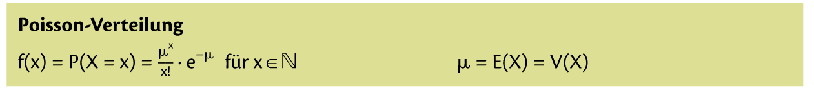
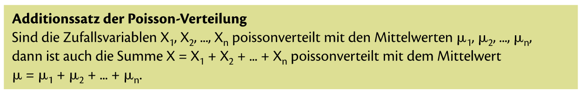

= Poissonverteilung

== Was ist die Poissonverteilung

_"Sobald in der Angabe eine Zahl steht (Konstante), kannst nur Poissonverteilung anwenden. "_ *~ Benjo*

Was meint Benjo damit?

Die Poissonverteilung wird als Modell für die Anzahl x von *Ereignissen*, die *pro Einheit* zufällig, unabhängig und mit dem *kosntanten Mittelwert μ* auftreten, verwendet.

Der *Mittelwert μ*, ist der einzige Parameter der Poissonverteilung. Sowohl dr Erwartungswert E(X) als auch die Varianz V(X) haben denselber Wert wie μ.

== Herleitung

Die Herleitung erflogt als Grenzfall der Binomialverteilung mit:

n -> unendlich +
p -> 0 +
n * p = μ

=== Mini Zusammenfassung

=== Daniel Jung Abi (gutes Beispiel)

link:https://www.youtube.com/watch?v=UESWARetzXU[Video by Daniel Jung]

== Mathe SA Index

link:https://davidenkovic.github.io/school-notes/math-sa-15.11.21.html[Mathe SA Index]
